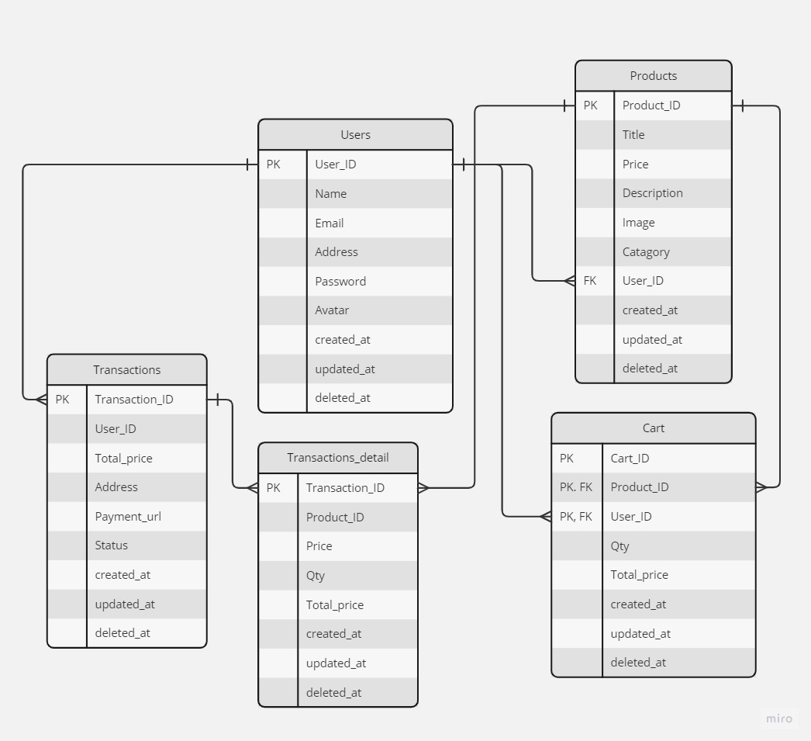

# toko kentang
RESTful API
It is built with Golang, PostgreSQL, Docker.

# Features
- CRUD (Users, Cart, Transactions)
- Hashing passwordgit 
- Authentication & Authorization
- Database Migration

# Project structure

```
.      
├── config     
│   ├── cloudinary.go        
│   ├── config.go      
│   ├── db.go      
├── features
│   ├── cart
│   │   ├─── data
|   |   |    ├── model.go
|   |   |    └── query.go      
│   │   ├─── handler
|   |   |    ├── handler.go
|   |   |    ├── request.go   
|   |   |    └── respone.go     
│   │   ├─── services
|   |   |    └── service.go
|   |   └─── entity.go
│   ├── product
│   │   ├─── data
|   |   |    ├── model.go
|   |   |    └── query.go      
│   │   ├─── handler
|   |   |    ├── handler.go
|   |   |    ├── request.go   
|   |   |    └── respone.go     
│   │   ├─── services
|   |   |    └── service.go
|   |   └─── entity.go
│   ├── transaction
│   │   ├─── data
|   |   |    ├── model.go
|   |   |    └── query.go      
│   │   ├─── handler
|   |   |    ├── handler.go
|   |   |    ├── request.go   
|   |   |    └── respone.go     
│   │   ├─── services
|   |   |    └── service.go
|   |   └─── entity.go
│   ├── transaction_detail
│   │   ├─── data
|   |   |    ├── model.go
|   |   |    └── query.go      
│   │   ├─── handler
|   |   |    ├── handler.go
|   |   |    ├── request.go   
|   |   |    └── respone.go     
│   │   ├─── services
|   |   |    └── service.go
|   |   └─── entity.go
│   └── user
│       ├─── data
|       |    ├── model.go
|       |    └── query.go      
│       ├─── handler
|       |    ├── handler.go
|       |    ├── request.go   
|       |    └── respone.go     
│       ├─── services
|       |    └── service.go
|       └─── entity.go
├── helper 
│   ├── cloudinary.go        
│   ├── dto.go
│   ├── pwd.go      
│   ├── jwt.go  
│   └── respone.go                
├── docker-compose.yml  
├── Dockerfile       
├── erd.jpg          
├── go.mod       
├── main.go
└── .env
```

# ERD


# Tools & Stacks
- Backend Stacks :
  - [Golang](https://go.dev/) : Programming Language
  - [Viper](https://github.com/spf13/viper) : Environment Reader
  - [Echo](https://echo.labstack.com/) : Web Framework
  - [JWT](https://jwt.io/) : Authentication & Authorization
  - [GORM](https://gorm.io/) : ORM Library
  - [MySQL](https://gorm.io/) : Database Management System
- Documentation :
  - [Postman](https://www.postman.com/) : API Testing & Documentation
  - [Swagger](https://swagger.io/) : Open API Documentation
- Deployment & Storage :
  - [Ubuntu](https://ubuntu.com/) : Development & Deployment OS
  - [Docker](https://docker.com/) : Containerization
  - [Amazon EC2](https://aws.amazon.com/) : Cloud server
  - [Cloudinary](https://cloudinary.com/) : Store and retrieve images

# Run
To run application you need :
- docker-compose
- .env file
## Env configuration

To run API locally you should create your own .env file in the root directory or rename `.env-example` to `.env`  
Example `.env`:
```env
DBUSER = root
DBPASS = root
DBHOST = postgres
DBPORT = 5432
DBNAME = myapp
JWTKey = koCakGemIng
```
# How to run

- Clone app on your machine
```
  $ git clone https://github.com/wussh/tokokentang.git
```
- Use Docker to run the whole system
```
  $ docker-compose up
```
# How to stop
- To stop the whole system
```
  $ docker-compose down
```

# Docker image
```
  $ docker pull wushie/tokokentang:v10
```
# API

Base url: `<host>:8080`

API documentation can be found [here](https://app.swaggerhub.com/apis/wussh/TokoKentang/1.0.0)

# Database

Once the Docker Compose is successfully up and running, you'll be able to conveniently access the database through your web browser using the following URL : `<host>:9100`. This is the point where you can interact with the database, perform queries, manage data, and utilize the various functionalities provided by the web-based interface. The setup will enable you to seamlessly handle the database operations, all within the convenience of your web browser, making the process efficient and accessible.